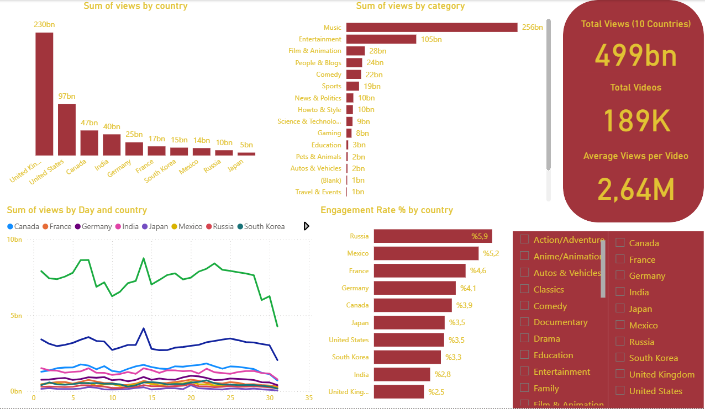

<p align="center">
  
</p>

# YouTube Global Trending – Power BI Dashboard

This repository contains a **Power BI dashboard** that analyses the global *YouTube Trending* dataset across **10 countries** (CA, US, GB, DE, FR, IN, JP, KR, MX, RU).

The goal of this project is to demonstrate **end-to-end BI skills** – from data modelling and DAX to interactive dashboard design and business insights.

---

## 🔍 Dataset

- Source: Kaggle – YouTube Trending Videos (multiple countries)
- Rows used in this model: **~418K**
- Countries: **10**
- Total views analysed: **~499B**
- Distinct videos: **~189K**

> The original CSV/JSON files are **not** stored in this repository due to size limits.  
> You can download the dataset from Kaggle and reconnect it to the model if needed.

---

## 📁 Files in this Repository

- `youtube_global_dashboard.pbit`  
  Power BI **template** of the dashboard. Load the Kaggle dataset using the same folder structure to refresh the model.

- `screenshots/dashboard_overview.png`  
  Static preview of the main report page.

- `README.md`  
  Project description, data model, DAX and insights (this file).

---

## 🧱 Data Model (Star Schema)

The model is built as a simple **star schema**:

### Fact Table

**`factVideos_Global`**

- Grain: *video – country – trending_date*
- Key fields:
  - `video_id`
  - `country`
  - `trending_date_date`
- Main numeric fields:
  - `views`, `likes`, `dislikes`, `comment_count`
  - flags: `comments_disabled`, `rating_disabled`, `video_error_or_removed`
  - dates: `publish_time`, `publish_date`, `trending_date_date`

### Dimension Tables

**`dimCountry`**

- `country_code` (CA, US, GB, …)  
- `country_name` (Canada, United States, …)

**`dimCategory`**

- `category_id`  
- `category_title` (Music, Entertainment, Film & Animation, …)

This structure allows flexible slicing by **country**, **category** and **date** while keeping the model performant and easy to understand.

---

## 📊 Dashboard Overview

The main report page includes:

- **KPI Panel**
  - **Total Views (10 Countries)** – ~499B  
  - **Total Videos** – ~189K  
  - **Average Views per Video** – ~2.64M  

- **Country Analysis**
  - Bar chart: total views by `country_name`
  - Additional Top-3 country visual to highlight the biggest markets

- **Category Analysis**
  - Bar chart: total views by `category_title`
  - Shows how Music, Entertainment and Film & Animation dominate global watch time

- **Time Series**
  - Line chart: daily total views by country
  - Highlights clear spikes that hint at viral content or seasonal events

- **Engagement Analysis**
  - Measure: `Engagement Rate % = (Total Likes + Total Comments) / Total Views`
  - Bar chart: engagement rate (%) by country

- **Slicers**
  - Country slicer (10 countries)
  - Category slicer (all YouTube categories)

You can see the layout in the screenshot below:



---

## 🧮 Key DAX Measures

Some of the core measures used in this model:

```DAX
Total Views =
    SUM ( factVideos_Global[views] )

Total Videos =
    DISTINCTCOUNT ( factVideos_Global[video_id] )

Average Views per Video =
    DIVIDE ( [Total Views], [Total Videos] )

Total Likes =
    SUM ( factVideos_Global[likes] )

Total Comments =
    SUM ( factVideos_Global[comment_count] )

Engagement Rate % =
    DIVIDE ( [Total Likes] + [Total Comments], [Total Views] )
These measures are reused across cards, bar charts and line chats to provide a consistent analytical layer.


💡 High-Level Insights

- The dashboard covers ~499B video views, ~189K distinct videos and 10 countries.

- United States, United Kingdom and Canada generate the highest view counts, while Russia, Mexico and France show the strongest engagement rate (%).

- Music, Entertainment and Film & Animation categories account for the majority of global watch time, whereas Blank, Shows and Movies remain relatively niche.

- Daily time-series charts reveal clear spikes in views, suggesting the impact of viral content and time-based events.

🧑‍💻 About the Author

This dashboard was built as part of my learning path in Data Analytics / Business Intelligence, focusing on:

Data modelling and star-schema design in Power BI

Writing clean and reusable DAX measures

Designing executive-ready dashboards with actionable insights

If you’d like to see the Python-based EDA project on the same dataset, you can check my other repository: https://github.com/tcdn7/9-Youtube-trending-analysis
